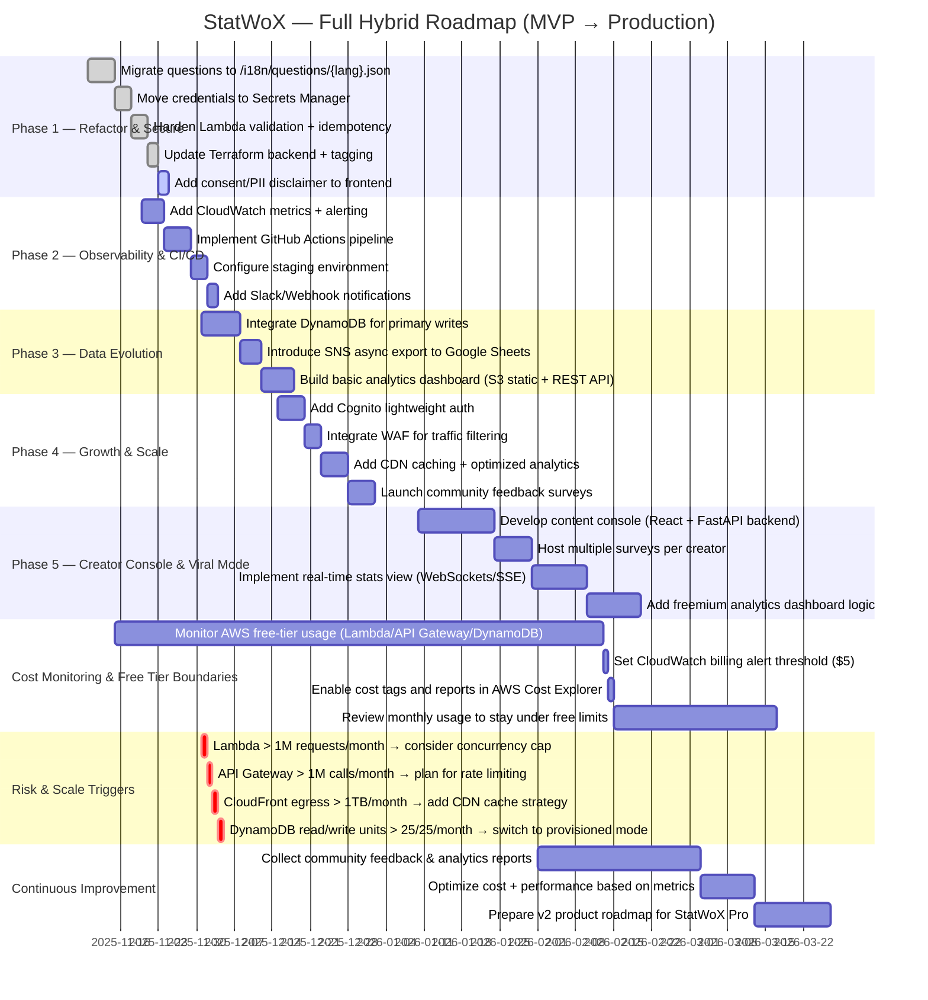

# StatWoX — The Hybrid Roadmap: Best of Both Worlds

## ⚙️ Vision

StatWoX stands at the intersection of creator-driven content and data-driven insight — a **personal platform for real engagement**. The goal is to empower creators (you) to host surveys, collect real-time insights, and interact with audiences through facts, not algorithms — all within a scalable, cost-optimized architecture.

This roadmap fuses the strengths of your current setup (simplicity, low cost, and flexibility) with professional-grade standards (security, modular design, CI/CD, observability, and scalability).

---

---
## 🧩 Architectural Philosophy

| Aspect               | MVP (Now)                                  | Scalable Upgrade                                              |
| -------------------- | ------------------------------------------ | ------------------------------------------------------------- |
| **Frontend**         | Static SPA (React/Tailwind, S3/CloudFront) | Progressive Web App (Next.js, offline cache, API-driven i18n) |
| **Backend**          | Lambda + Google Sheets                     | Lambda + DynamoDB + optional Google Sheets export             |
| **Secrets**          | Env vars in Terraform                      | AWS Secrets Manager (fetched at runtime)                      |
| **Data Flow**        | Direct write → Google Sheets               | Event-driven (Lambda → DynamoDB → SNS → Sheets async)         |
| **Auth & Identity**  | None                                       | Cognito / Email Token Auth (minimal friction)                 |
| **Infra Management** | Terraform local backend                    | Terraform remote (S3 + DynamoDB lock + tagging)               |
| **CI/CD**            | Manual deploys                             | GitHub Actions: test, build, validate, deploy                 |
| **Monitoring**       | CloudWatch basic logs                      | Structured logs + Grafana dashboard + Alerts                  |

## 🧱 Core Layers Breakdown

### 1️⃣ Frontend Layer

* Refactor question logic into external `i18n/questions/{lang}.json` files.
* Add a language selector; preload translations from CDN.
* Integrate analytics hooks (track question completion, drop-offs).
* Improve accessibility (keyboard, ARIA roles, responsive typography).
* Add **local caching** (IndexedDB) for offline response storage.

### 2️⃣ Backend Layer (Lambda API)

* Keep Google Sheets write-through for now, but **introduce DynamoDB** for structured storage:

  * Partition key: `survey_id`
  * Sort key: `response_id`
  * Global secondary index: `timestamp` for analytics.
* Lambda workflow:

  1. Validate & sanitize payload.
  2. Check idempotency via `session_id + survey_id`.
  3. Write to DynamoDB.
  4. Publish SNS event for async Google Sheets export.
  5. Return a success response with `response_token`.

### 3️⃣ Infrastructure Layer (Terraform)

* Consolidate all envs (`dev`, `prod`) with a single Terraform workspace.
* Use variable-driven naming conventions and tags.
* Migrate all secrets → AWS Secrets Manager.
* Re-enable ACM + CloudFront + WAF for HTTPS & spam protection.
* Use DynamoDB for state locking and metadata tracking.

### 4️⃣ Security & Privacy Layer

* Add consent checkbox and PII disclaimer.
* Implement CloudFront WAF rules for bot protection.
* Anonymize or hash PII in DynamoDB before analytics aggregation.
* Rotate all secrets every 90 days automatically.

### 5️⃣ Observability Layer

* Add JSON logging in Lambda (`level`, `message`, `reqId`, `timestamp`).
* Use CloudWatch metric filters for error rates, latency, and throttling.
* Integrate Grafana dashboard for response trends.
* Optional: Send Slack alerts for error spikes.

### 6️⃣ CI/CD Layer (GitHub Actions)

* Pipeline stages:

  1. Lint + format + test frontend.
  2. Terraform validate + plan (PR only).
  3. Zip Lambda → upload to S3 artifact.
  4. Deploy infra + frontend + Lambda (on merge to `main`).
* Inject env vars securely via GitHub Secrets:

  ```yaml
  env:
    API_URL: ${{ secrets.API_URL }}
    GOOGLE_CREDS_SECRET_ARN: ${{ secrets.GOOGLE_CREDS_SECRET_ARN }}
    SHEET_ID: ${{ secrets.SHEET_ID }}
  ```

---

## 🧠 Best of Both Worlds — Philosophy

**From Google Sheets simplicity → to DynamoDB robustness**.

1. **Use Google Sheets for visibility:** easy exports for non-technical stakeholders.
2. **Use DynamoDB for durability:** instant reads, structured queries, low-latency aggregation.
3. **Combine both via async pipelines:** maintain flexibility and professional reliability.

This dual-system architecture means you can grow without breaking your startup budget — free-tier where possible, scale-tier when viral.

---

## 🪜 Final Roadmap (Phased Implementation)

### 🔹 Phase 1 — "Refactor & Secure" (0–2 Weeks)

* [x] Migrate question data to `/i18n/questions/{lang}.json`.
* [x] Move credentials to Secrets Manager.
* [x] Harden Lambda validation + idempotency.
* [x] Update Terraform state backend + tagging.
* [ ] Add consent/PII disclaimer to frontend.

### 🔹 Phase 2 — "Observability & CI/CD" (3–5 Weeks)

* [ ] Add CloudWatch metrics + alerting.
* [ ] Add GitHub Actions CI/CD.
* [ ] Implement staging environment.
* [ ] Add Slack/Webhook notifications on failed deploys.

### 🔹 Phase 3 — "Data Evolution" (6–8 Weeks)

* [ ] Integrate DynamoDB for primary writes.
* [ ] Introduce SNS event for async export to Google Sheets.
* [ ] Build basic analytics dashboard (S3 static + REST API).

### 🔹 Phase 4 — "Growth & Scale" (8–12 Weeks)

* [ ] Add Cognito lightweight auth for survey owners.
* [ ] Integrate WAF for traffic filtering.
* [ ] Add CDN caching and optimized analytics pipeline.
* [ ] Begin community feedback surveys directly through StatWoX.

### 🔹 Phase 5 — "Creator Console & Viral Mode" (3–6 Months)

* [ ] Develop content console (React + FastAPI backend).
* [ ] Allow creators to host multiple surveys.
* [ ] Implement real-time stats view (WebSocket / Server-Sent Events).
* [ ] Add freemium plan logic — paid analytics dashboard (when viral).

---

## 🚀 Conclusion

StatWoX now has a dual-track foundation — **speed and simplicity of a startup, strength and scalability of a SaaS.**

The MVP remains cost-free and fast to iterate, while every upgrade builds toward a serverless, secure, fully observable, multilingual platform for truth-based engagement.

**Tagline for internal doc:**

> “From opinions to outcomes — StatWoX makes every response count.”
